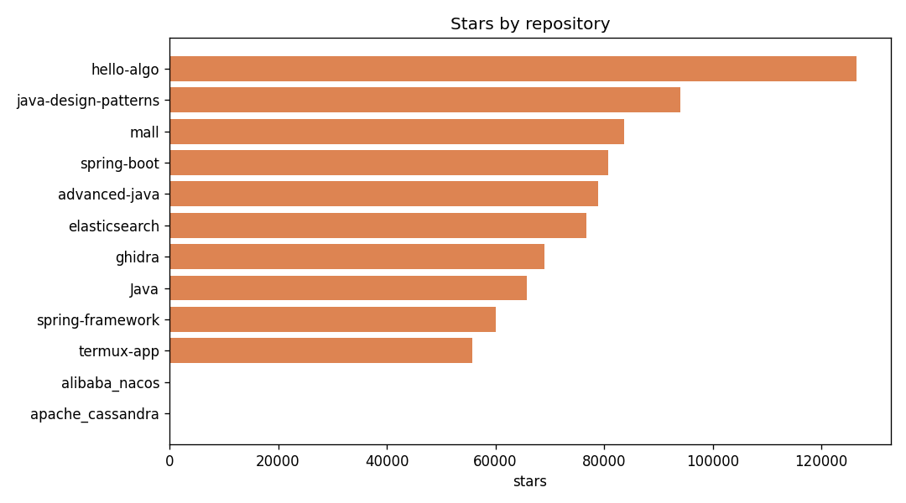
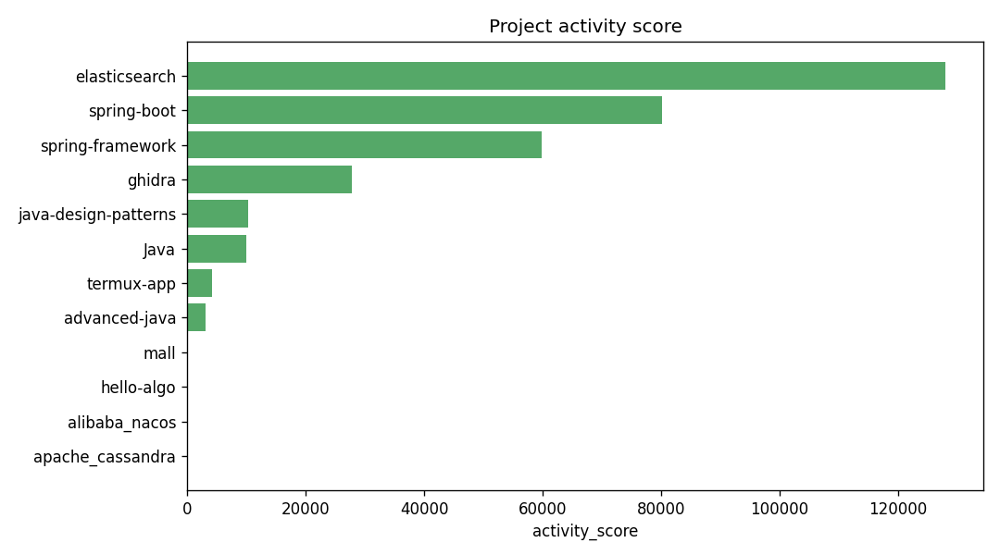
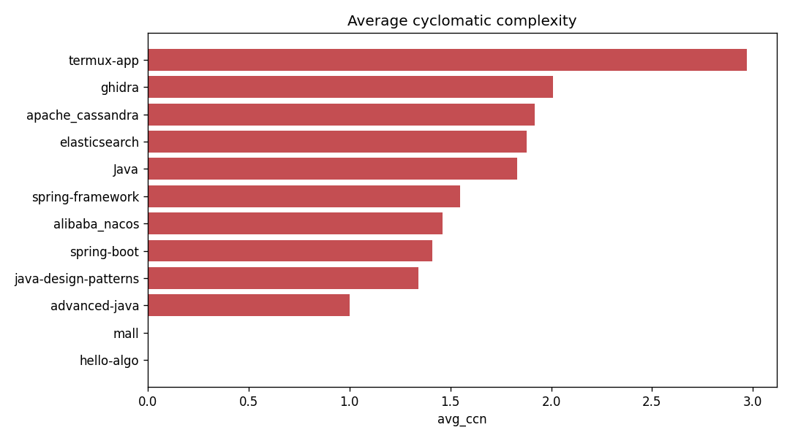
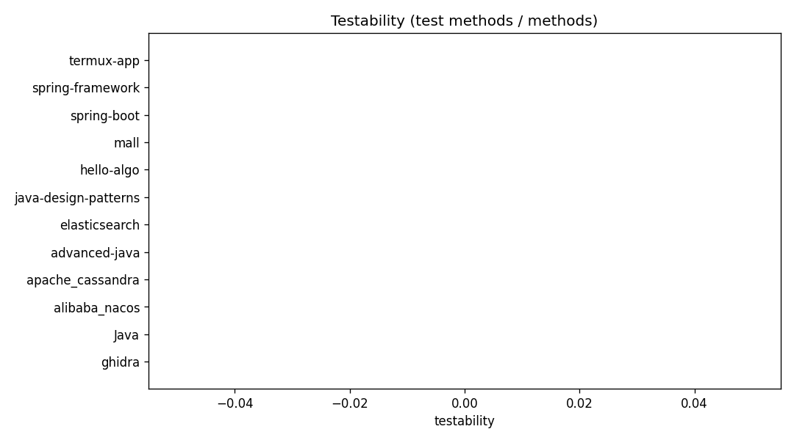
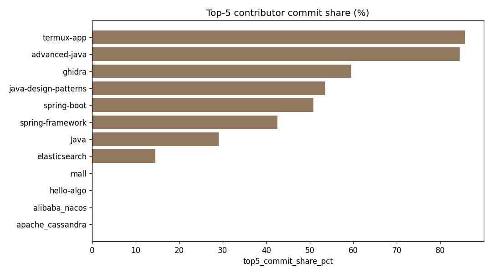

# GitHub Metrics Analyzer - Final Report

Repositories analyzed: **12**

## Repository ranking (by activity score)

| repository                       |   stars |   forks |   total_commits |   contributors |   avg_ccn |   testability |   activity_score |
|:---------------------------------|--------:|--------:|----------------:|---------------:|----------:|--------------:|-----------------:|
| elastic/elasticsearch            |   76776 |   25949 |          100700 |           3007 |      1.88 |             0 |           127975 |
| spring-projects/spring-boot      |   80730 |   41933 |           61387 |           1676 |      1.41 |             0 |            80132 |
| spring-projects/spring-framework |   60007 |   38826 |           35064 |           1374 |      1.55 |             0 |            59859 |
| NationalSecurityAgency/ghidra    |   69046 |    7591 |           17554 |            445 |      2.01 |             0 |            27784 |
| iluwatar/java-design-patterns    |   94077 |   27367 |            4364 |            548 |      1.34 |             0 |            10274 |
| TheAlgorithms/Java               |   65751 |   21171 |            3204 |            822 |      1.83 |             0 |             9924 |
| termux/termux-app                |   55773 |    6690 |            1504 |            101 |      2.97 |             0 |             4254 |
| doocs/advanced-java              |   78987 |   19214 |             785 |             56 |      1    |             0 |             3132 |
| apache_cassandra                 |       0 |       0 |               0 |              0 |      1.92 |             0 |                0 |
| alibaba_nacos                    |       0 |       0 |               0 |              0 |      1.46 |             0 |                0 |
| krahets/hello-algo               |  126492 |   15110 |               0 |              0 |      0    |             0 |                0 |
| macrozheng/mall                  |   83750 |   29704 |               0 |              0 |      0    |             0 |                0 |

## Charts

### Stars

### Activity

### Complexity

### Testability

### Concentration

## Contribution concentration risk

| repository                       |   contributors |   top5_commit_share_pct | concentration_risk   |
|:---------------------------------|---------------:|------------------------:|:---------------------|
| termux/termux-app                |            101 |                   85.71 | high                 |
| doocs/advanced-java              |             56 |                   84.41 | high                 |
| NationalSecurityAgency/ghidra    |            445 |                   59.51 | low                  |
| iluwatar/java-design-patterns    |            548 |                   53.5  | low                  |
| spring-projects/spring-boot      |           1676 |                   50.89 | low                  |
| spring-projects/spring-framework |           1374 |                   42.58 | low                  |
| TheAlgorithms/Java               |            822 |                   29.08 | low                  |
| elastic/elasticsearch            |           3007 |                   14.55 | low                  |
| apache_cassandra                 |              0 |                    0    | low                  |
| alibaba_nacos                    |              0 |                    0    | low                  |
| krahets/hello-algo               |              0 |                    0    | low                  |
| macrozheng/mall                  |              0 |                    0    | low                  |

## Testability & maintainability

| repository                       |   total_loc |   avg_ccn |   avg_method_nloc |   avg_method_params |   test_methods |   testability |
|:---------------------------------|------------:|----------:|------------------:|--------------------:|---------------:|--------------:|
| NationalSecurityAgency/ghidra    |     2046111 |      2.01 |              9.59 |                0.98 |          18295 |             0 |
| TheAlgorithms/Java               |       85507 |      1.83 |              7.67 |                0.63 |           3930 |             0 |
| alibaba_nacos                    |      383591 |      1.46 |              8.54 |                0.69 |          11712 |             0 |
| apache_cassandra                 |      989367 |      1.92 |             10.18 |                1.07 |          10679 |             0 |
| doocs/advanced-java              |           5 |      1    |              3    |                1    |              0 |             0 |
| elastic/elasticsearch            |     3372487 |      1.88 |             11.08 |                1.01 |            179 |             0 |
| iluwatar/java-design-patterns    |       50632 |      1.34 |              7.02 |                0.52 |           1285 |             0 |
| krahets/hello-algo               |           0 |      0    |              0    |                0    |              0 |             0 |
| macrozheng/mall                  |           0 |      0    |              0    |                0    |              0 |             0 |
| spring-projects/spring-boot      |       50383 |      1.41 |              6.97 |                0.78 |           1025 |             0 |
| spring-projects/spring-framework |      854571 |      1.55 |              7.09 |                0.74 |          23600 |             0 |
| termux/termux-app                |       26896 |      2.97 |              9.86 |                1.28 |              3 |             0 |

## Modularity

| repository                       |   classes |   interfaces |   methods |   inheritance_links |
|:---------------------------------|----------:|-------------:|----------:|--------------------:|
| NationalSecurityAgency/ghidra    |         0 |            0 |         0 |                   0 |
| TheAlgorithms/Java               |         0 |            0 |         0 |                   0 |
| alibaba_nacos                    |         0 |            0 |         0 |                   0 |
| apache_cassandra                 |         0 |            0 |         0 |                   0 |
| doocs/advanced-java              |         0 |            0 |         0 |                   0 |
| elastic/elasticsearch            |         0 |            0 |         0 |                   0 |
| iluwatar/java-design-patterns    |         0 |            0 |         0 |                   0 |
| krahets/hello-algo               |         0 |            0 |         0 |                   0 |
| macrozheng/mall                  |         0 |            0 |         0 |                   0 |
| spring-projects/spring-boot      |         0 |            0 |         0 |                   0 |
| spring-projects/spring-framework |         0 |            0 |         0 |                   0 |
| termux/termux-app                |         0 |            0 |         0 |                   0 |

## Pull request health

| repository                       |   pr_open |   pr_closed |   avg_commits_per_pr |   avg_pr_close_hours |
|:---------------------------------|----------:|------------:|---------------------:|---------------------:|
| NationalSecurityAgency/ghidra    |       133 |         167 |                 2.27 |               791.52 |
| TheAlgorithms/Java               |        20 |         280 |                 3.87 |               200.41 |
| alibaba_nacos                    |         0 |           0 |                 0    |                 0    |
| apache_cassandra                 |         0 |           0 |                 0    |                 0    |
| doocs/advanced-java              |         0 |         142 |                 1.84 |                59.97 |
| elastic/elasticsearch            |       125 |         175 |                 3.77 |                16.06 |
| iluwatar/java-design-patterns    |        86 |         214 |                 3.21 |              1192.71 |
| krahets/hello-algo               |         0 |           0 |                 0    |                 0    |
| macrozheng/mall                  |         0 |           0 |                 0    |                 0    |
| spring-projects/spring-boot      |        20 |         280 |                 1.39 |                71.99 |
| spring-projects/spring-framework |        63 |         237 |                 2.95 |               116.45 |
| termux/termux-app                |        49 |         251 |                 3.47 |               641.16 |

## Top refactoring hotspots (commits x complexity)

| repository                       | file                                                                                                         |   commits |   avg_ccn |   hotspot_score |
|:---------------------------------|:-------------------------------------------------------------------------------------------------------------|----------:|----------:|----------------:|
| elastic/elasticsearch            | modules/lang-painless/src/main/java/org/elasticsearch/painless/AnalyzerCaster.java                           |        42 |  42.5556  |        1787.33  |
| elastic/elasticsearch            | test/framework/src/main/java/org/elasticsearch/search/RandomSearchRequestGenerator.java                      |        54 |  30.3333  |        1638     |
| elastic/elasticsearch            | server/src/main/java/org/elasticsearch/Version.java                                                          |       450 |   2.90476 |        1307.14  |
| elastic/elasticsearch            | x-pack/plugin/esql/src/main/java/org/elasticsearch/xpack/esql/analysis/Analyzer.java                         |       266 |   4.82734 |        1284.07  |
| elastic/elasticsearch            | x-pack/plugin/esql/src/main/java/org/elasticsearch/xpack/esql/action/EsqlCapabilities.java                   |       807 |   1.46154 |        1179.46  |
| elastic/elasticsearch            | server/src/test/java/org/elasticsearch/index/engine/InternalEngineTests.java                                 |       330 |   3.33032 |        1099     |
| elastic/elasticsearch            | server/src/main/java/org/elasticsearch/action/search/TransportSearchAction.java                              |       226 |   4.75806 |        1075.32  |
| elastic/elasticsearch            | server/src/main/java/org/elasticsearch/repositories/blobstore/BlobStoreRepository.java                       |       392 |   2.7284  |        1069.53  |
| spring-projects/spring-framework | spring-beans/src/main/java/org/springframework/beans/factory/support/DefaultListableBeanFactory.java         |       267 |   3.84354 |        1026.22  |
| elastic/elasticsearch            | server/src/main/java/org/elasticsearch/rest/action/cat/RestIndicesAction.java                                |        56 |  17.4444  |         976.889 |
| elastic/elasticsearch            | server/src/main/java/org/elasticsearch/snapshots/SnapshotsService.java                                       |       331 |   2.92174 |         967.096 |
| elastic/elasticsearch            | server/src/main/java/org/elasticsearch/snapshots/RestoreService.java                                         |       201 |   4.72727 |         950.182 |
| elastic/elasticsearch            | test/framework/src/main/java/org/elasticsearch/test/rest/ESRestTestCase.java                                 |       364 |   2.55665 |         930.621 |
| elastic/elasticsearch            | server/src/main/java/org/elasticsearch/index/shard/IndexShard.java                                           |       423 |   2.19192 |         927.182 |
| elastic/elasticsearch            | server/src/main/java/org/elasticsearch/index/engine/InternalEngine.java                                      |       330 |   2.76724 |         913.19  |
| elastic/elasticsearch            | test/framework/src/main/java/org/elasticsearch/test/InternalTestCluster.java                                 |       351 |   2.54491 |         893.263 |
| elastic/elasticsearch            | test/framework/src/main/java/org/elasticsearch/test/ESIntegTestCase.java                                     |       396 |   2.16832 |         858.653 |
| elastic/elasticsearch            | x-pack/plugin/esql/src/main/java/org/elasticsearch/xpack/esql/plugin/ComputeService.java                     |       195 |   4.31579 |         841.579 |
| elastic/elasticsearch            | x-pack/plugin/esql/src/main/java/org/elasticsearch/xpack/esql/planner/LocalExecutionPlanner.java             |       282 |   2.97959 |         840.245 |
| spring-projects/spring-framework | spring-beans/src/main/java/org/springframework/beans/factory/support/AbstractAutowireCapableBeanFactory.java |       182 |   4.59211 |         835.763 |

---
_Generated by the GitHub Metrics Analyzer pipeline._